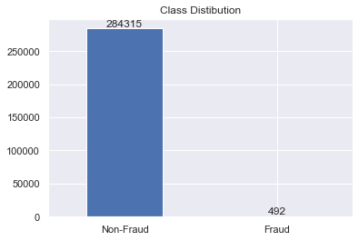
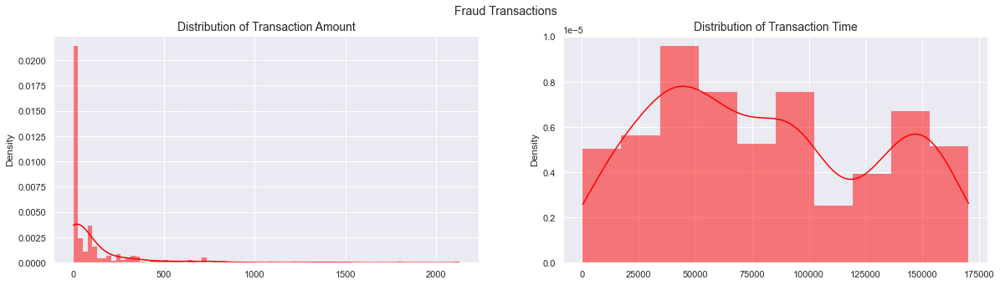
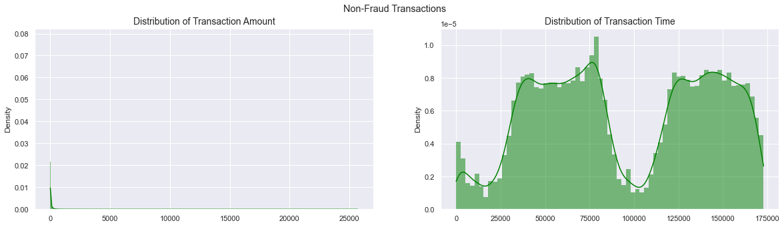
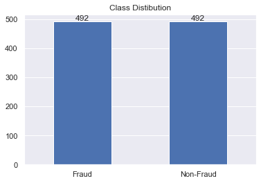
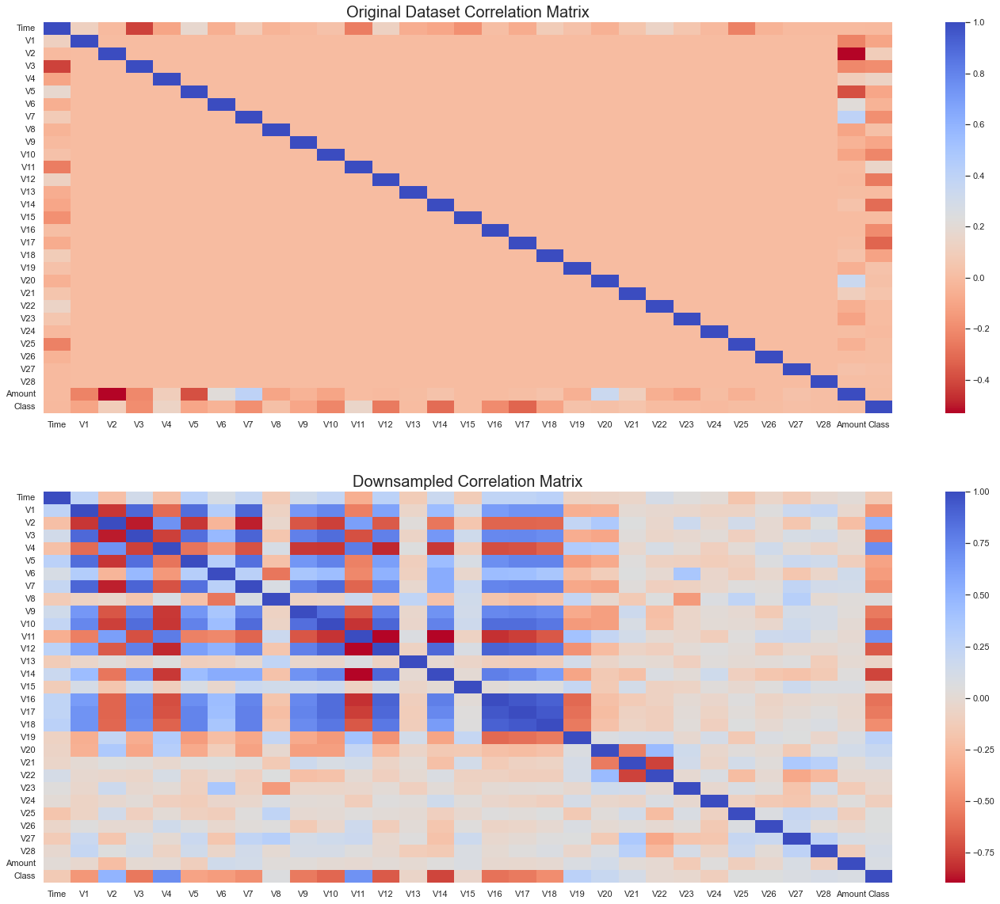
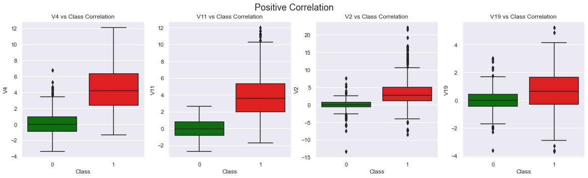
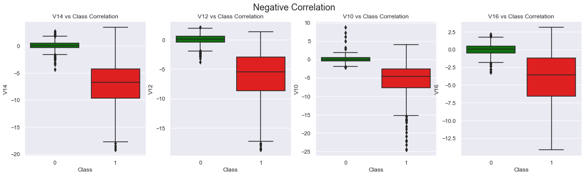
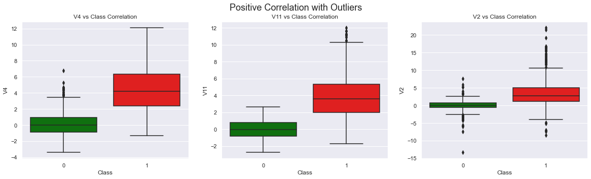
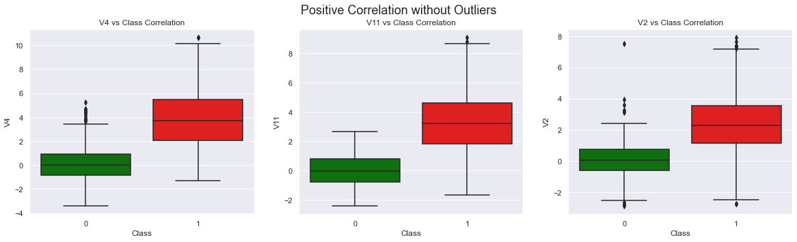

# Credit-Fraud

This repo is an attempt to try to detect fraud transactions using predictive ML models using a highly imbalanced dataset.

We start by trying to understand the data, prepocess it, undersampling the data for better correlation checks, *(will implement the overampling in the future)*, and evaluating models.

## Brief Walkthrough

### Dataset Distibution
**99.8%** of the transaction are **non-fraud**, using this as at is for our predictive models, they most likely **overfit** as it will just assume it to be **non-fraud** and not be able to detect patterns that lead to **fraud**.

### Distribution
Looking at the distribution gives us an idea of how skewed the data is.

### Sampling and Correlations
Random Under Sampling is implemented to have a balanced dataset to be able to check for correlations and avoid overfitting.

#### Correlation Matrix on original and balanced dataset

#### Anomaly Detection
Some of the features with high correlations seem to have **extreme outliers**. Removing them will most likely have a positive impact on the model trying to find the right pattern.

Though, we have to be careful when setting a threshold for removing the outliers. Being aggressive when removing outliers could result in important data loss and being quiet the opposite may not removing remove some of the extreme outiers. This is a *tradeoff* where the best action to take is to play with the threshold and see how it affects the model performance.

## Results
Six models where tried, each of which GridSearchCV was tried to be able be able to determine the best parameters for the model.

Classifier | Score 
--- | --- 
LogisiticRegression | 93.66%
KNearest | 93.22%
SupportVectorClassifier | 93.80%
DecisionTreeClassifier | 92.22%
RandomForestClassifier | 93.51%
GradientBoostingClassifier | 93.22%
